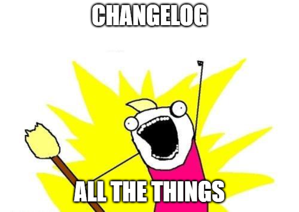

# Change Log Tool

Every pulled your hair out becaues of merge conclicts resulting from adding or removing a changelog entry... fear no more



## Preconditions

In order for the command line utility to work the command needs to be executed from the root directory of the repo. The changelog.md should be located in `./docs/` folder.

If any of these preconditions are not fulfilled the tool will tell you about it.

## Installation

This tool will be provided as dotnet tool.

To install tool:

```bash
dotnet tool install ChangeLogTool -g --add-source https://pkgs.dev.azure.com/buhlergroup/_packaging/buhlergroup-internal/nuget/v3/index.json
```

To update tool:

```bash
dotnet tool update ChangeLogTool -g --add-source https://pkgs.dev.azure.com/buhlergroup/_packaging/buhlergroup-internal/nuget/v3/index.json
```

## Help

The tool also provides a `help` command which can simply be run via `clt help`

## Operation Modes

Currently the tool has two main operation modes. One mode for `adding` changelog entries and one mode for generating a `changelog file for a specific version`

If you want further information on these modes the command `clt help add` and `clt help g` can be run any time

## Command line options

Main command line options:

```bash
  add                 Add a new changelog message

  g                   Generate a new changelog for a specific release

  help                Display more information on a specific command.

  version             Display version information.
```

### Command line options for `add` command

```bash
  At least one option from group 'add' (f, fixed, a, added, c, changed, r, removed) is required.
  Required option 't, text' is missing.

  -f, --fixed       (Group: add) Add changelog entry 'fixed'

  -a, --added       (Group: add) Add changelog entry 'added'

  -c, --changed     (Group: add) Add changelog entry 'changed'

  -r, --removed     (Group: add) Add changelog entry 'removed'

  -i, --issueId    Set manually a issue id. (eg PBUZIOT-12345

  -t, --text        Required. The description of the change log entry.

  -h, --isHotFix    Is the entry for a Hotfix?

  --help            Display this help screen.

  --version         Display version information.

```

### Command line options for `g` command

```bash
  At least one option from group 'release' (M, major, m, minor, h, hotfix) is required.

  -M, --major     (Group: release) Generate Major Release (vx.0.0)

  -m, --minor     (Group: release) Generate Minor Release (vx.x.0)

  -h, --hotfix    (Group: release) Generate HotFix Release (vx.x.x)

  --help           Display this help screen.

  --version       Display version information.

```

## Adding changelog entries

Currently we have the following changelog types:

- Fixed
- Added
- Changed
- Removed

One of these types has to be specified when running the `add` command.

For example to add a changelog entry of type `Added` simply run the command `clt add -a -t "My cool new feature"`.

Next you need to provide a changelog message. Note that **you do not have to prefix your message with Added** this is done automatically for you.

Each time you run the add command a `json file with a filetimestamp as the name` will be generated under the `docs/changelog` folder.

The JSON file looks like the following:

```json
{
  "Id": "469085f4-5bff-491c-81a1-633d5253bed8",
  "Version": "0.1.0.0",
  "IssueId": "myIssueId",
  "IsHotFix": false,
  "Prefix": "Added",
  "Text": "test",
  "FullChangeLogMessage": "Added: test (myIssueId)"
}
```

In addition to the type of the changelog and the message it is also possible to provide an **issueId**.
The issueId is the Number of the JIRA Ticket. If the issueId is not provided, it will be automatically extracted from the branch name.

The command with a provided issueID would look like the following:
`clt add -a -i PBUZIOT-001 -t "my text"`

## Generating a release changelog version

In order to generate a release changelog for a specific version, simply run the command `clt g -m`. Upon running this command the following steps are executed:

- Decide what version it should be  (Major, Minor or Hotfix)
- Pick only those JSON Files which have a Version between last and the new version which should be created
- Generate a new section for the new version inside the changelog.md file and copy the text from the matching JSON Files over.

In order to generate a release changelog for a specific version and create a new ReleaseBranch and create a Tag, simply run the command `clt g -m -p`. Upon running this command the following steps are executed:

- Decide what version it should be  (Major, Minor or Hotfix)
- Pick only those JSON Files which have a Version between last and the new version which should be created
- Generate a new section for the new version inside the changelog.md file and copy the text from the matching JSON Files over.
- The File will be commmitet and create a message and create a ReleaseBranch and a Tag and push it all on the remote Branch.

For Set a its own Version number in the appropriate places (Major, minor, hotfix) , simply 
run the command `clt g -m -v 15 ` . Upon running this from the following steps are executed:

- Decide what version it should be  (Major, Minor or Hotfix)
- Pick only those JSON Files which have a Version between last and the new version which should be created
- Generate a new section for the new version inside the changelog.md file what are manuell Set and copy the text from the matching JSON Files over.
- With the command `clt g -m -v 15 -p`The File will be commmitet and create a message and create a ReleaseBranch and a Tag and push it all on the remote Branch.


